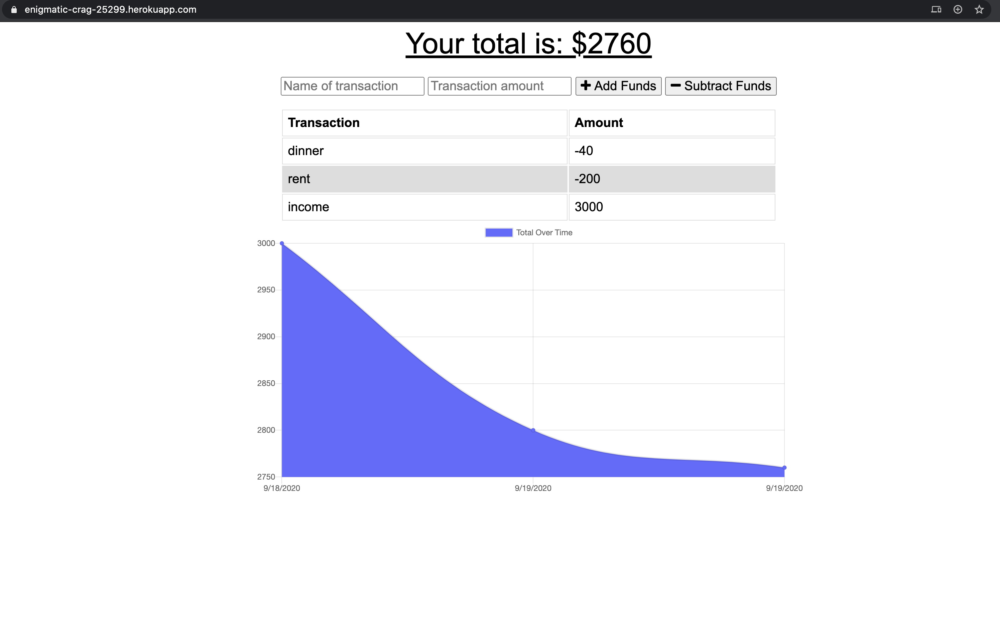

# Budget Tracker
  

  ## Preview
  

  ## Description
  * Budget Tracker is an application that allows user to track withdrawals and deposits with or without a data/internet connection.
  * Deployed application on Heroku: https://enigmatic-crag-25299.herokuapp.com/

  ## Table of Contents
  * [Installation](#installation)
  * [Usage](#Usage)
  * [License](#License)
  * [Contributing](#Contributing)
  * [Questions](#Questions)

  ## Installation
  To install necessary dependencies, run the following command:

      npm i

  ## Usage
  To use this app directly, click on the Heroku link under [Description](#Description). 
 1. Enter name of transaction
 2. Enter transaction amount
 3. Click 'Add Funds' or 'Subtract Funds' to add transaction.
 4. When in offline mode, transactions will be save in indexedDB (aka your local computer database)
 5. When back online, transactions in indexedDB will be saved online.

  ## License
  * MIT

  ## Contributing
  The app is contributed by Melody Lo and Trilogy Education Services.

  ## Questions
  * If you have any questions, feel free to contact me via email: yiling.melody.lo@gmail.com
  * My GitHub profile: https://github.com/roukell

  